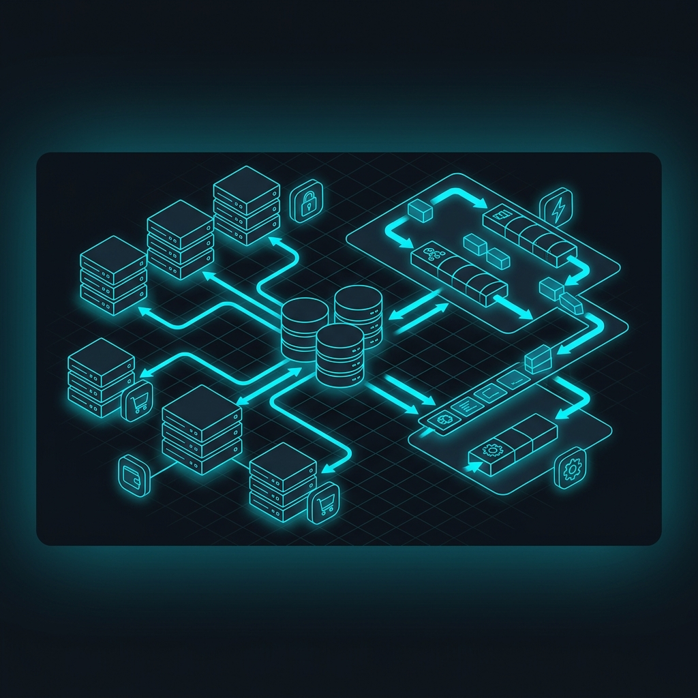

<div align="center">

<!-- ═══════════════════════════════════════════════════════════════ -->
<!-- 🎨 HEADER: Custom Banner                                      -->
<!-- ═══════════════════════════════════════════════════════════════ -->


<!-- ═══════════════════════════════════════════════════════════════ -->
<!-- ⌨️ TYPING ANIMATION: Multi-line rotating text                 -->
<!-- ═══════════════════════════════════════════════════════════════ -->


<br>

<!-- ═══════════════════════════════════════════════════════════════ -->
<!-- 🏷️ BADGES: Profile views + Social links                      -->
<!-- ═══════════════════════════════════════════════════════════════ -->

<a href="https://github.com/Son-Uchiha">

</a>
&nbsp;
<a href="https://github.com/Son-Uchiha?tab=followers">

</a>
&nbsp;
<a href="https://github.com/Son-Uchiha?tab=repositories&sort=stargazers">

</a>

<br><br>

<a href="mailto:uchihason5@gmail.com">

</a>
&nbsp;
<a href="https://son-uchiha.github.io/Portfolio/">

</a>

</div>

<br>

<!-- ═══════════════════════════════════════════════════════════════ -->
<!-- ⚡ TECH STACK: Animated skill icons with category headers     -->
<!-- ═══════════════════════════════════════════════════════════════ -->


<h2>
&nbsp;
Tech Arsenal
</h2>

<div align="center">


<br><br>

<!-- Animated Floating Tech Stack -->


</div>

<br>

<table align="center">
<tr>
<td align="center" width="50%">

### 💻 Languages
<br>

<br><br>


</td>
<td align="center" width="50%">

### 🚀 Backend
<br>

<br><br>


</td>
</tr>
<tr>
<td align="center" width="50%">

### 🗄️ Databases & Cache
<br>

<br><br>


</td>
<td align="center" width="50%">

### ☁️ DevOps & Cloud
<br>

<br><br>


</td>
</tr>
<tr>
<td align="center" width="50%">

### ⚡ Queue & Messaging
<br>

<br><br>


</td>
<td align="center" width="50%">

### 🛠 Tools
<br>

<br><br>


</td>
</tr>
</table>

<br>

<!-- ═══════════════════════════════════════════════════════════════ -->
<!-- 🐍 SNAKE ANIMATION: Contribution graph eaten by snake         -->
<!-- ═══════════════════════════════════════════════════════════════ -->

<div align="center">

<picture>
  <source media="(prefers-color-scheme: dark)" srcset="https://raw.githubusercontent.com/Son-Uchiha/Son-Uchiha/output/github-snake-dark.svg" />
  <source media="(prefers-color-scheme: light)" srcset="https://raw.githubusercontent.com/Son-Uchiha/Son-Uchiha/output/github-snake.svg" />
  
</picture>

</div>

<br>

<!-- ═══════════════════════════════════════════════════════════════ -->
<!-- 👨‍💻 ABOUT ME: Animated terminal code block                    -->
<!-- ═══════════════════════════════════════════════════════════════ -->


<h2>
&nbsp;
About Me
</h2>


```typescript
class BackendDeveloper {
  name       = "Shawn Nguyen";
  role       = "Backend Developer";
  education  = "Information Technology @ PTIT (3rd year)";
  
  languages  = ["TypeScript", "Java", "Python", "C++"];
  
  backend    = {
    primary:   ["NestJS", "Node.js"],
    learning:  ["Spring Boot", "Express"],
    databases: ["MySQL", "PostgreSQL", "MongoDB"],
    cache:     ["Redis"],
    queue:     ["BullMQ", "Apache Kafka"],
    orm:       ["Prisma"]
  };
  
  devops     = ["Docker", "Kubernetes", "AWS", "GitHub Actions"];
  
  architecture = [
    "Microservices", "Event-Driven",
    "CQRS", "Domain-Driven Design"
  ];

  motto = () => "Build it right, build it resilient 🔥";
}
```

<br clear="both">

<br>


<!-- ═══════════════════════════════════════════════════════════════ -->
<!-- 🚀 FEATURED PROJECTS: Cards with custom image                 -->
<!-- ═══════════════════════════════════════════════════════════════ -->


<h2>
&nbsp;
Featured Projects
</h2>

<div align="center">



</div>

<br>

<table align="center">
<tr>
<td width="50%">

### 🛒 E-Commerce Backend
<br>

> Production-ready system built for **high throughput** and **data consistency**


**Highlights:**
- ⚡ Atomic Decrement checkout (Row-Level X-Lock)
- 🔐 JWT + Token Rotation + Redis Blacklist
- 🏗️ Decoupled Worker via `createApplicationContext()`
- 📬 SMTP mail queue + 15min delayed cancellation
- 💳 VNPay IPN with Idempotency architecture
- 🛡️ 3-tier RBAC Guard system

</td>
<td width="50%">

### 💬 Realtime Chat App
<br>

> **WebSocket-based** messaging with JWT authentication


**Highlights:**
- 🔄 Real-time bidirectional communication
- 🔐 JWT-secured WebSocket connections
- 📡 Redis Pub/Sub for scaling
- 👥 Online presence tracking

<br>

### 🌐 Portfolio Website
<br>

> **Japanese Cyberpunk** themed personal site


🔗 [**Live Demo →**](https://son-uchiha.github.io/Portfolio/)

</td>
</tr>
</table>

<br>

<!-- ═══════════════════════════════════════════════════════════════ -->
<!-- 📊 GITHUB STATS: Activity graph + Streak                     -->
<!-- ═══════════════════════════════════════════════════════════════ -->


<h2>
&nbsp;
GitHub Analytics
</h2>

<div align="center">


<br><br>


</div>

<br>

<!-- ═══════════════════════════════════════════════════════════════ -->
<!-- 📈 SKILL PROGRESS: Visual progress bars                       -->
<!-- ═══════════════════════════════════════════════════════════════ -->


<h2>
&nbsp;
Development Focus
</h2>

<div align="center">

```text
 Backend Engineering    ┣━━━━━━━━━━━━━━━━━━━━━━━━━━━━━━━━━━━━━━━━━━━━━━━━━━┫  90%
 NestJS Ecosystem       ┣━━━━━━━━━━━━━━━━━━━━━━━━━━━━━━━━━━━━━━━━━━━━━━━━━━┫  90%
 Database Architecture  ┣━━━━━━━━━━━━━━━━━━━━━━━━━━━━━━━━━━━━━━━━━━━━━━━━━░┫  85%
 Redis & BullMQ         ┣━━━━━━━━━━━━━━━━━━━━━━━━━━━━━━━━━━━━━━━━━━░░░░░░░░┫  80%
 System Design          ┣━━━━━━━━━━━━━━━━━━━━━━━━━━━━━━━━━━━░░░░░░░░░░░░░░░┫  70%
 Docker & CI/CD         ┣━━━━━━━━━━━━━━━━━━━━━━━━━━━━━━░░░░░░░░░░░░░░░░░░░░┫  60%
 Spring Boot            ┣━━━━━━━━━━━━━━━━━━━━━━━━━░░░░░░░░░░░░░░░░░░░░░░░░░┫  50%
 Kubernetes & AWS       ┣━━━━━━━━━━━━━━━━━━░░░░░░░░░░░░░░░░░░░░░░░░░░░░░░░░┫  35%
```

</div>

<br>

<!-- ═══════════════════════════════════════════════════════════════ -->
<!-- 📚 LEARNING: Animated learning roadmap                        -->
<!-- ═══════════════════════════════════════════════════════════════ -->


<h2>
&nbsp;
Currently Learning
</h2>

<div align="center">


<br><br>


</div>

<br>

<!-- ═══════════════════════════════════════════════════════════════ -->
<!-- 🤝 CONNECT: Animated contact section                          -->
<!-- ═══════════════════════════════════════════════════════════════ -->


<h2>
&nbsp;
Let's Connect
</h2>

<div align="center">

<a href="mailto:uchihason5@gmail.com">

</a>
<br><br>
<a href="https://github.com/Son-Uchiha">

</a>
<br><br>
<a href="https://son-uchiha.github.io/Portfolio/">

</a>

</div>

<br>

<!-- ═══════════════════════════════════════════════════════════════ -->
<!-- 🎵 FOOTER: Quote + Animated wave                              -->
<!-- ═══════════════════════════════════════════════════════════════ -->

<div align="center">


<br><br>


</div>


